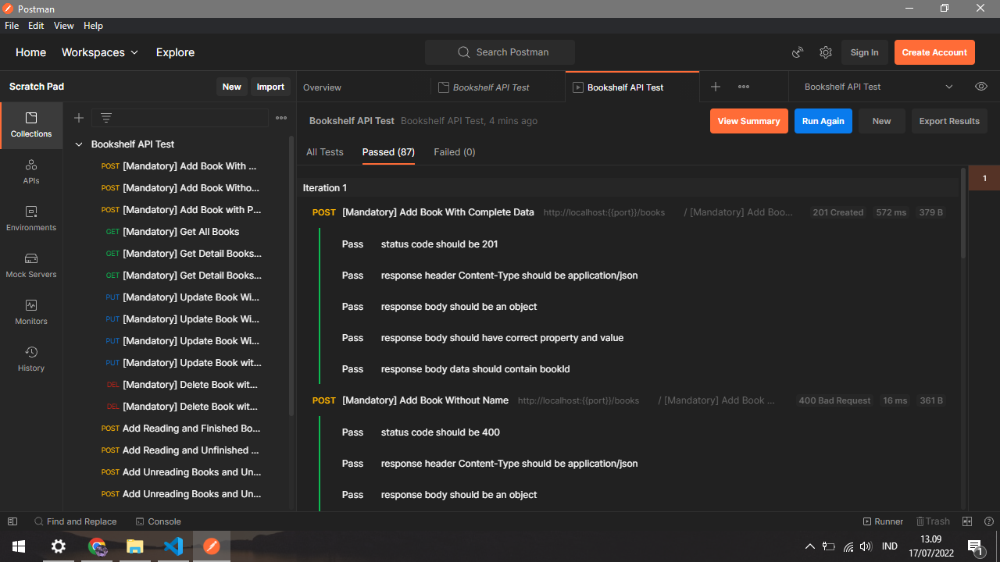

# Bookshelf API

This is a project to fulfill the graduation requirements of the Learn to Create Back-End Applications for Beginners from Dicoding

## Testing Result



## How To Run

before running this project make sure that node is installed on your device

### Clone Project

run this command

```bash
git clone https://github.com/adityatriand/bookshelf-api.git
```

### Install Project

run the following commands sequantially

```bash
npm install
```

```bash
npm run start
```
